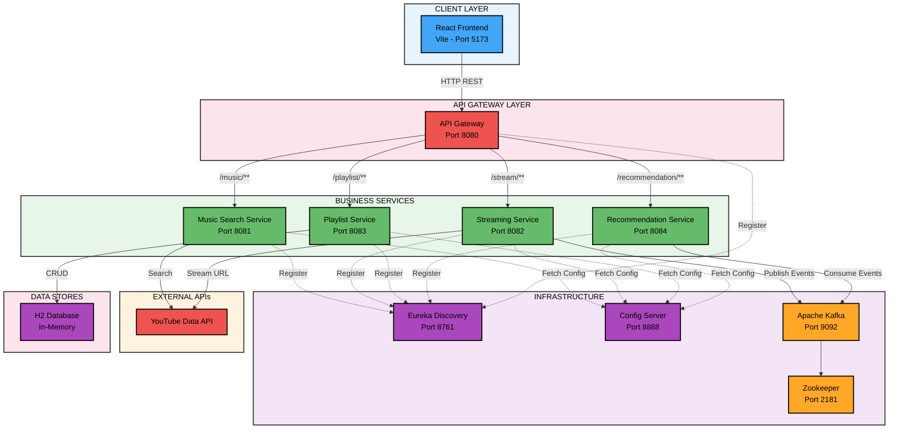
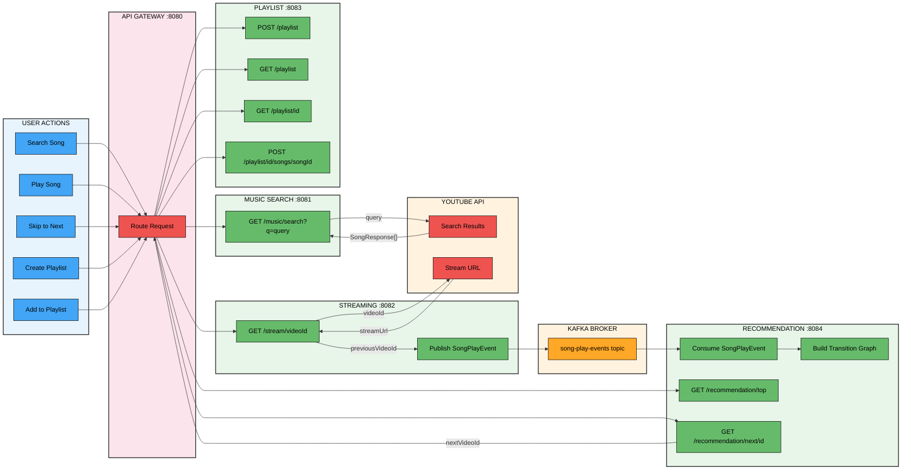
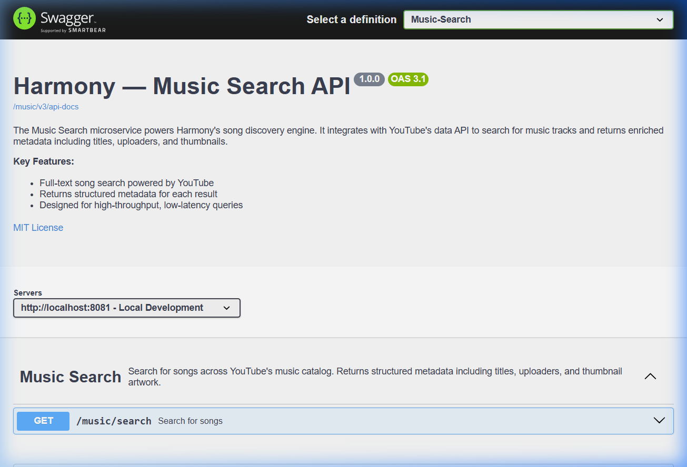
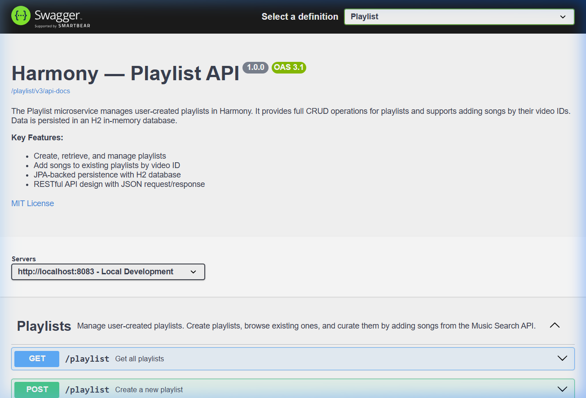
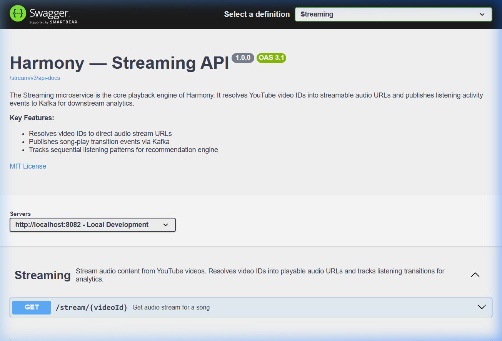
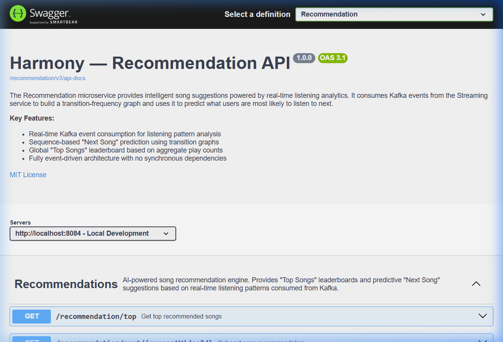
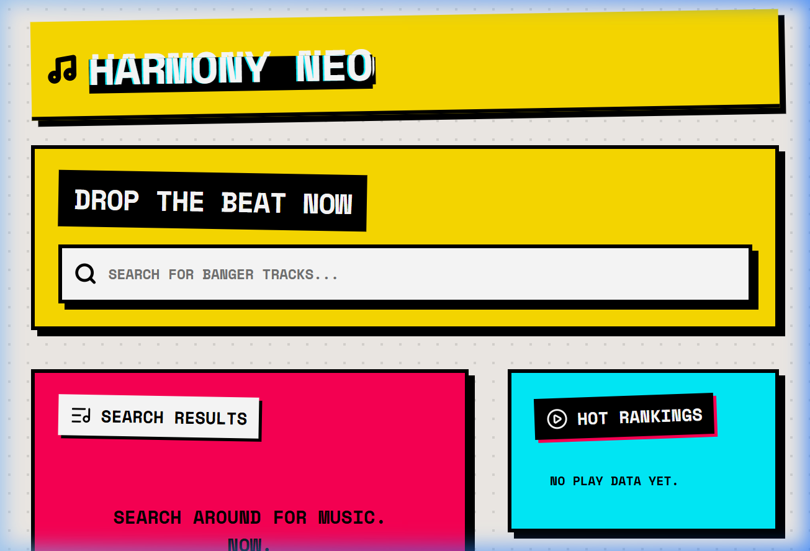

<div align="center">

# 🎵 Harmony — Music Streaming Platform

**A cloud-native, microservice-based music streaming platform built with Spring Boot, React, Kafka, and Eureka.**

[](https://spring.io/projects/spring-boot)
[](https://reactjs.org/)
[](https://kafka.apache.org/)
[](https://docs.docker.com/compose/)
[](https://opensource.org/licenses/MIT)

</div>

---

## 📖 Table of Contents

- [Overview](#-overview)
- [Architecture](#-architecture)
- [Data Flow Diagram](#-data-flow-diagram)
- [Microservices](#-microservices)
- [API Reference](#-api-reference)
- [Swagger UI](#-swagger-ui)
- [Frontend](#-frontend)
- [Tech Stack](#-tech-stack)
- [Getting Started](#-getting-started)
- [Project Structure](#-project-structure)

---

## 🌟 Overview

Harmony is a full-stack music streaming platform that demonstrates modern microservice architecture patterns. Users can search for songs, stream audio, create playlists, and receive intelligent recommendations — all powered by an event-driven backend.

### ✨ Key Highlights

- **Microservice Architecture** — 6 independently deployable services communicating via REST and Kafka
- **Event-Driven Recommendations** — Real-time listening analytics fed through Apache Kafka
- **Service Discovery** — Netflix Eureka for dynamic service registration
- **Centralized Config** — Spring Cloud Config Server for externalized configuration
- **API Gateway** — Single entry point with Spring Cloud Gateway MVC
- **Unified API Docs** — Aggregated Swagger UI across all services

---

## 🏗 Architecture



---

## 🔄 Data Flow Diagram

The diagram below traces how data flows through the system for core user operations, showing every API endpoint involved.



### 📋 Flow Breakdown

| # | User Action | API Calls (in order) | Data Flow |
|---|---|---|---|
| 1 | **Search for a song** | `GET /music/search?q=...` | Frontend → Gateway → Music Search → YouTube API → Response |
| 2 | **Play a song** | `GET /stream/{videoId}?previousVideoId=...` | Frontend → Gateway → Streaming → YouTube (stream URL) + Kafka (event) |
| 3 | **Skip to next song** | `GET /recommendation/next/{currentVideoId}` → `GET /music/search?q={nextId}` → `GET /stream/{nextId}` | Frontend → Gateway → Recommendation → (enrich via Search) → Stream |
| 4 | **View trending** | `GET /recommendation/top?limit=4` → `GET /music/search?q={id}` ×4 | Frontend → Gateway → Recommendation → (enrich each via Search) |
| 5 | **Create playlist** | `POST /playlist` | Frontend → Gateway → Playlist Service → H2 DB |
| 6 | **Add song to playlist** | `POST /playlist/{id}/songs/{songId}` | Frontend → Gateway → Playlist Service → H2 DB |
| 7 | **View playlist** | `GET /playlist/{id}` → `GET /music/search?q={songId}` ×N | Frontend → Gateway → Playlist → (enrich each via Search) |

---

## 🎤 Microservices

### 1. Discovery Service (Eureka Server)
| Property | Value |
|---|---|
| **Port** | `8761` |
| **Role** | Service registry for all microservices |
| **Dashboard** | `http://localhost:8761` |

### 2. Config Service
| Property | Value |
|---|---|
| **Port** | `8888` |
| **Role** | Centralized configuration management |

### 3. API Gateway
| Property | Value |
|---|---|
| **Port** | `8080` |
| **Role** | Single entry point, request routing, Swagger aggregation |
| **Swagger UI** | `http://localhost:8080/swagger-ui.html` |

### 4. Music Search Service
| Property | Value |
|---|---|
| **Port** | `8081` |
| **Role** | Song discovery via YouTube API |
| **Endpoints** | `GET /music/search?q={query}` |

### 5. Streaming Service
| Property | Value |
|---|---|
| **Port** | `8082` |
| **Role** | Audio stream resolution + Kafka event publishing |
| **Endpoints** | `GET /stream/{videoId}?previousVideoId={id}` |

### 6. Playlist Service
| Property | Value |
|---|---|
| **Port** | `8083` |
| **Role** | CRUD operations for playlists (H2 database) |
| **Endpoints** | `POST /playlist`, `GET /playlist`, `GET /playlist/{id}`, `POST /playlist/{id}/songs/{songId}` |

### 7. Recommendation Service
| Property | Value |
|---|---|
| **Port** | `8084` |
| **Role** | Real-time song recommendations via Kafka events |
| **Endpoints** | `GET /recommendation/top`, `GET /recommendation/next/{videoId}` |

---

## 📡 API Reference

### Music Search API

| Method | Endpoint | Description | Parameters |
|---|---|---|---|
| `GET` | `/music/search` | Search for songs | `q` — search query string (required) |

**Response:** `SongResponse[]`
```json
[
  {
    "id": "dQw4w9WgXcQ",
    "title": "Rick Astley - Never Gonna Give You Up",
    "uploader": "Rick Astley",
    "thumbnailUrl": "https://i.ytimg.com/vi/dQw4w9WgXcQ/hqdefault.jpg"
  }
]
```

### Streaming API

| Method | Endpoint | Description | Parameters |
|---|---|---|---|
| `GET` | `/stream/{videoId}` | Get audio stream URL | `videoId` (path), `previousVideoId` (query, optional) |

**Response:** `StreamResponse`
```json
{
  "videoId": "dQw4w9WgXcQ",
  "streamUrl": "https://rr3---sn-example.googlevideo.com/videoplayback?..."
}
```

### Playlist API

| Method | Endpoint | Description | Parameters |
|---|---|---|---|
| `POST` | `/playlist` | Create a new playlist | Body: `{ "name": "...", "songIds": [...] }` |
| `GET` | `/playlist` | Get all playlists | — |
| `GET` | `/playlist/{id}` | Get playlist by ID | `id` (path) |
| `POST` | `/playlist/{id}/songs/{songId}` | Add song to playlist | `id`, `songId` (path) |

### Recommendation API

| Method | Endpoint | Description | Parameters |
|---|---|---|---|
| `GET` | `/recommendation/top` | Get top recommended songs | `limit` (query, default: 10) |
| `GET` | `/recommendation/next/{currentVideoId}` | Predict next song | `currentVideoId` (path) |

---

## 📸 Swagger UI

All API documentation is aggregated through the API Gateway at **`http://localhost:8080/swagger-ui.html`**.

### Music Search API Documentation


### Playlist API Documentation


### Streaming API Documentation


### Recommendation API Documentation


---

## 🎨 Frontend

The frontend is a **React + Vite** application with a bold neo-brutalist design. It communicates exclusively through the API Gateway.

### Main Interface


### Frontend Features

- 🔍 **Search** — Full-text song search with thumbnail previews
- ▶️ **Stream** — In-browser audio playback with progress bar
- ⏭️ **Skip Forward** — AI-powered next-song prediction
- 📋 **Playlists** — Create and manage custom mixtapes
- 🔥 **Hot Rankings** — Real-time trending songs leaderboard
- ❤️ **Quick Save** — Add currently playing song to any playlist

---

## 🛠 Tech Stack

| Layer | Technology |
|---|---|
| **Frontend** | React 18, Vite, Axios, Lucide Icons |
| **API Gateway** | Spring Cloud Gateway MVC |
| **Backend** | Spring Boot 3.4.3, Java 21 |
| **Service Discovery** | Netflix Eureka |
| **Configuration** | Spring Cloud Config |
| **Messaging** | Apache Kafka (Confluent 7.3.2) |
| **Database** | H2 (In-Memory) |
| **API Docs** | SpringDoc OpenAPI (Swagger UI) |
| **Build Tool** | Maven |
| **Containerization** | Docker Compose |

---

## 🚀 Getting Started

### Prerequisites

- **Java 21+** (JDK)
- **Node.js 18+** & npm
- **Docker & Docker Compose** (for Kafka)

### 1. Start Infrastructure

```bash
# Start Kafka & Zookeeper
docker-compose up -d
```

### 2. Start Microservices (in order)

```bash
# 1. Discovery Service
cd discovery-service && ./mvnw spring-boot:run

# 2. Config Service
cd config-service && ./mvnw spring-boot:run

# 3. Business Services (can start in parallel)
cd music-search-service && ./mvnw spring-boot:run
cd streaming-service && ./mvnw spring-boot:run
cd playlist-service && ./mvnw spring-boot:run
cd recommendation-service && ./mvnw spring-boot:run

# 4. API Gateway
cd api-gateway && ./mvnw spring-boot:run
```

### 3. Start Frontend

```bash
cd frontend
npm install
npm run dev
```

### 4. Access the Application

| Component | URL |
|---|---|
| 🎵 **Frontend** | http://localhost:5173 |
| 🚪 **API Gateway** | http://localhost:8080 |
| 📖 **Swagger UI** | http://localhost:8080/swagger-ui.html |
| 🔍 **Eureka Dashboard** | http://localhost:8761 |

---

## 📁 Project Structure

```
Harmony/
├── api-gateway/                  # Spring Cloud Gateway MVC
├── config-service/               # Spring Cloud Config Server
├── discovery-service/            # Netflix Eureka Server
├── music-search-service/         # YouTube song search API
├── streaming-service/            # Audio streaming + Kafka producer
├── playlist-service/             # Playlist CRUD + H2 database
├── recommendation-service/       # Kafka consumer + prediction engine
├── frontend/                     # React + Vite frontend
├── docker-compose.yml            # Kafka & Zookeeper containers
├── docs/
│   └── screenshots/              # Swagger & frontend screenshots
└── README.md
```

---

<div align="center">

**Built with ❤️ using Spring Boot, React, and Kafka**

</div>
